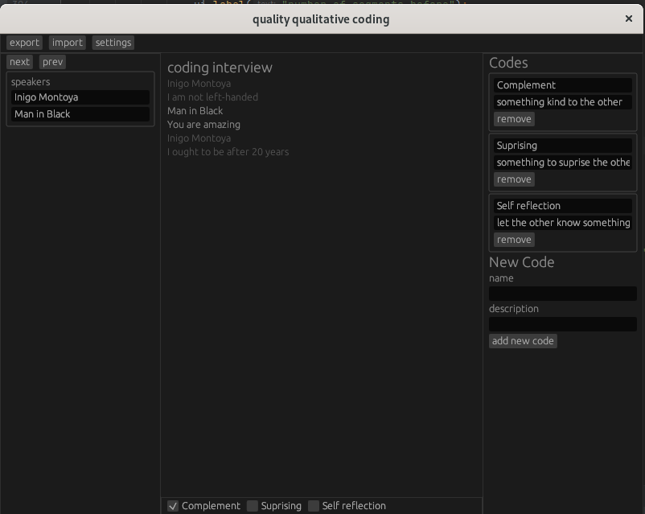

# Quality Qualitative Coding

Quality Qualitative Coding (qqc) is a small graphical utility to enable collaborative qualitative coding of interviews. Try it out [here](https://marcusdunn.github.io/qqc/)!

## How to use
- upload an interview (some json formats or vtt)
- create codes on the right panel or import a master codebook from CSV
- change speaker names on the left panel 
- down-arrow for next segment
- up-arrow for previous segment
- right arrow to correct speakers
- select codes on the bottom
- export the interview or your codes to CSV using the export button.

## Privacy and Security

All data is stored locally as I simply cannot afford a server!

## There's very little javascript in this webapp

This is written as a cross-platform rust app that can be run both as a native app and in the browser via wasm. This is made possible by the awesome [egui](https://github.com/emilk/egui/) library.
